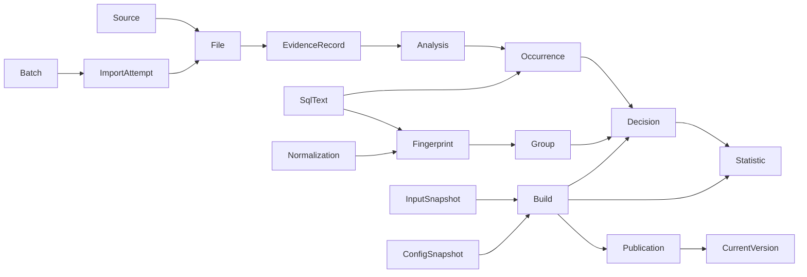

# 首期离线基线逻辑数据契约

## Summary

契约版本 `1.0.0`，定义输入溯源、规范化执行／调用、统计及构建输出三个交接边界。
这是 Issue #3 授权产出的设计；字段表和样例可供后续实现与独立评审核对，
不表示解析器、存储、统计引擎或运行时校验器已实现。既有业务规则仍由所属主题页维护。

阅读顺序：本文的关系及约束 → [字段字典](../../docs/design/offline-data-contract/fields.md)
→ [HashData 映射](../../docs/design/offline-data-contract/hashdata-mapping.md)
→ [需求对应与样例说明](../../docs/design/offline-data-contract/README.md)。

## Source Of Truth

用户于 2026-09-26 确认 Issue #3 的九项验收及实施计划，并授权按计划实施。
本文的对象、字段、枚举和版本约定属于该设计任务的产出，不新增业务分组、
训练排除或发布阈值。真实输入事实以不可变来源证据为准，业务要求以关联主题页为准，
设计验收以在线 Issue 为准。样例均为人工合成；调查覆盖率不作为配对或训练准确率。

## Contracts

### C01：类型、版本和缺失值

每份交接数据声明 `contract_version` 和 `profile`。首期 profile 为
`hashdata-csv/1`，含义限于已调查 HashData 构建，适用边界见来源映射。
对象引用使用不透明逻辑 ID，不规定 UUID、哈希或数据库主键算法。
同类型 ID 在数据集内唯一；引用必须指向对应类型的对象，并满足所属集群、规则及版本约束。

所有字段的必填／可空规则以字段字典为准。`null` 表示已声明的未知或不适用，
不表示零、空字符串或默认成功；未知量同时有状态或原因。可空字段仍显式给出，
可省略的只有字典标为可选的补充证据。非有限数值、负耗时、悬空引用及相互矛盾的状态
属于契约错误；源记录存在这些问题时保留证据和诊断，不伪造合法训练样本。

时间使用带偏移的时间点；HashData 业务表示统一为 UTC+8，自然日及自然周按此计算。
耗时使用非负十进制毫秒，保留来源小数精度；样例用十进制字符串避免 JSON 浮点改写，
这不是数据库类型或序列化框架的选择。计数为非负整数；比值和对数统计无单位。

### C02：三个边界与对象关系

| 边界 | 生产者 → 消费者 | 对象 |
| --- | --- | --- |
| 输入和导入 | 人工来源／文件清单与导入器 → 解析、诊断及构建编排 | Source、File、Batch、ImportAttempt、EvidenceRecord |
| 规范化数据 | 来源适配、关联与 SQL 处理 → 训练筛选、存储、历史查询 | Analysis、SqlText、Occurrence、Normalization、Fingerprint、Group、Decision、Problem |
| 基线输出 | 构建／统计／发布 → 存储、CLI、后续查询展示 | InputSnapshot、ConfigSnapshot、Build、Statistic、Publication、CurrentVersion、Task |

箭头表示数据依赖，实际外键方向见字段字典。日志来源不是额外聚合维度。
一个请求可包含多条 SQL；一个 Execute 调用可由多条证据支持。
不要求还原请求、Parse、Bind、Execute 的完整父子链；缺少链关系不会凭空生成父执行。

### C03：来源、文件与安全重试

Source 固定逻辑来源和集群映射及其配置依据，路径改名不改变身份。
File 表示某来源下的一份不可变内容；内容身份和校验摘要用途分开，
哈希碰撞处理、身份算法及存储事务留待实现，不能仅凭文件名、时间交集或 SQL 相同判重。
只有同源、内容一致且已成功导入才可 `duplicate_skipped`，并引用此前成功尝试。
失败／中断重试有新的 ImportAttempt，复用同一 File；未完成数据不能纳入构建。
逻辑记录身份为 `(file_id, record_no)`，物理行区间只作定位；跨行 SQL 不增加记录数。

Batch 的人工文件齐全声明与程序处理完成分别记录；全部清单项成功或有效跳过、
且无未解决文件冲突才可完成。每个清单项引用一个最终有效尝试；历史失败尝试不删除。
可靠部分重叠／变更只记录冲突证据、暂停受影响文件并阻止本批次发布，首期不自动合并。
可靠隔离的记录问题允许文件处理完成；边界损坏导致无法可靠隔离则文件失败。
以上行为沿用[导入要求](../features/log-ingestion.md)，本设计不保证发现全部重叠。

### C04：事实与解释、原文与执行身份

EvidenceRecord 保存来源定位和直接观察字段，原文件／校验摘要保留相关事实依据。
Analysis 固定来源映射、解析和关联解释版本；Occurrence 是该解释下的一次可靠识别的
请求或阶段／调用。`occurrence_id` 由实现保持实际事件身份，不能使用 SQL 文本、指纹、
最近时间或命令号相等替代。跨解释修订不能原地改写旧 Occurrence；引用以
`(analysis_id, occurrence_id)` 确定，重解释不代表新增真实执行。
无法可靠识别事件边界时，只保存 EvidenceRecord 和 Problem，不先创造执行次数。
同一构建对同一证据事件只选择一套解释；不能同时计入旧解释和修订解释。

SqlText 按完整、可可靠取得的源 SQL 精确内容复用，不去空白、注释或归一化常量后去重。
`sql_id` 不等于结构指纹；不同执行可引用同一 sql_id，指纹相同的不同原文仍分别保留。
无法可靠获得完整 SQL 时 `sql_id=null`，残片只保留在来源证据中；不得用空文本、
原文摘要或部分可解析子句补造完整 SQL。原始占位参数保持原样，不恢复 DETAIL 实参。
原文和明细不因每版构建而复制，沿用[存储契约](sql-storage.md)。

### C05：计时、状态与关联证据

Occurrence 分别记录事件单位、结果状态、计时分类、关联状态和 SQL 完整性。
五类分别为 `request`、`execute_first`、`execute_fetch`、`parse`、`bind`；
未知分类使用 `timing_type=null` 加原因，不是第六类基线。
`request` 表示单条或完整批次请求；其他类别仅表示本次调用／阶段完成，
`outcome=success` 不证明整个 SQL／portal 已结束。两条 Execute 配对证据形成一个调用。
阶段耗时不能相加成请求耗时，阶段数不能相加成完整执行数。

分类和结果均要求证据定位与解释版本，不能只靠 LOG、SQLSTATE 00000、文本非空
或源码行号宣称成功可训练。Execute 首次／续取必须有同次调用可靠配对的 2764 证据；
配对不确定时保留已知事实、原因及诊断。Parse／Bind 简略和详细输出分支纳入同类，
不要求完整协议链，仍需可靠 SQL 归属。详细规则见[计时契约](timing-and-grouping.md)。

`end_at` 来源于选定完成／终止证据；只有结束时间和 duration 均可靠才有
`estimated_start_at=end_at-duration_ms`，其依据固定为 `end_minus_duration`。
失败记录的已知耗时仍须说明计时范围，不能伪称完整成功执行。
未知 duration 为 null；真实日志零值为 0，推算开始等于结束，不能混淆二者。
开始时间不是 activity query_start；跨日、周或小时都不拆样本。

### C06：归一化与分组

Normalization 固定算法／解析能力版本及函数字典的规则版本和确定内容摘要；
摘要语义与现有字典工具的 `sha256` 一致，不把文件字节 SHA 当作该摘要。
Fingerprint 针对 `(sql_id, normalization_id, profile)` 返回可靠结果或带原因的失败。
未知函数按 #1 已交付的保守规则处理，不自动等于指纹失败；无法可靠生成结构时不训练。

HashData Group 的逻辑键仍为
`cluster_id + database + execution_user + fingerprint_value + timing_type`。
`profile`、`normalization_id` 是解释上下文，阻止跨来源语义、跨规则版本误比较，
不是新增业务聚合维度。同一版本同一上下文相同五项只能有一个 Group。
来源、会话、命令号、portal 只作证据；单条和整批结构必须可区分，批次顺序保留。
数据库／用户缺失不能用占位字符串加入正常分组，不能猜测隐含 schema。

### C07：训练决策与排除计数

Decision 是某 Build 对某 Occurrence 的一次规则解释，引用该版本的 Group 和配置。
`included`、`excluded`、`unresolved`、`outside_window` 分别表示实际参与、明确排除、
可靠性不足暂不参与、推算开始不在窗口。状态不明、耗时未知、指纹失败等不能默认纳入。
成功长耗时本身不是排除理由；[资格与黑名单](training-eligibility.md)规则完整适用。
单条／整批各计一次，纯黑名单批次排除，混合批次不因其局部语句命中而整体排除，
不扣除或分摊子语句耗时。函数及类别规则所有权仍分别属于 #1、#2。

Decision 记录全部已知原因及规则引用；`not_evaluated` 显式区分未能判断与未命中。
故障／维护按整个推算区间与配置半开区间比较，正耗时仅端点相接不命中；
零耗时按 `exclude_start <= t < exclude_end` 判定。
未知时间不可假定不重叠，不能从结束日期冒充推算开始日期。

排除总数对本范围可可靠识别、归组及时间归属的非训练事件去重；各原因按同一事件
同一原因去重，原因数之和可以大于总数。请求计数单位为请求，阶段／调用各自计数，
不能合成业务执行总数。缺少 Group、timing_type 或开始时间时 `count_scope=batch`，
保留 Problem 及诊断数量，不分摊到五类或日期桶。`outside_window` 不计窗口排除总数。

### C08：五层统计、覆盖和空值

每条 Statistic 对应 Build、Group 和一个 Bucket。Bucket 仅选一个层次键：
整体无附加键，逐天为日期，逐周为周一日期，跨周星期为 ISO 星期 1–7，跨天小时为 0–23。
窗口为含截止日在内的指定自然日数，半开 `[start_date 00:00, cutoff_date+1 00:00)`。
逐周范围取自然周与窗口交集，`partial_week` 只说明窗口裁剪，与实际样本覆盖分开。
每层直接使用自己的样本，不能平均其他层的分位数或累加五层数量当真实次数。

字段字典覆盖[全部指标、公式和门槛](baseline-statistics.md)：基础、P95、P99
分别存门槛、实际数量／覆盖及不足原因。五类五层独立检查，不借用其他桶样本。
可计算指标即使不足仍有值；无样本和分母为零分别有 null 原因，合法 0 保留。
每个指标均有 `value` 和 `reason`，不以一个总体错误清空其余可计算指标。
达标只是试行数量条件，不声明稳定性或自动异常判断可用。

未观察分组的全集不可推断，因此不要求为不存在的所有 SQL 构造空组。
Build 的五类覆盖摘要必须齐全；已有 Group 的窗口覆盖索引声明各层已计算桶及无样本桶，
使“完整计算且没有样本”与“漏算”可区分。物理上是否保存每个空桶另行选择，
交接语义必须能展开出 count=0、指标 null/no_samples 的结果；空桶也可有排除数。

### C09：固定输入、发布与恢复

InputSnapshot 固定已完成 Batch、成功 File、可用 Analysis 和精确事件选择依据；
路径或最大时间戳不构成固定输入。ConfigSnapshot 固定训练窗口、来源配置、
归一化、类别／模板黑名单、排除区间、样本门槛和统计公式版本及实际内容依据。
采用只读快照或不可变引用，不复制每版明细。普通配置修改或后来日志不能改变运行中的 Build。

Build 按集群完成五类五层输出，记录计算与保存结果及完整性、一致性检查。
各 Group 的逐天、逐周、跨周星期、跨天小时样本数分别求和等于整体数，不能跨层相加；
分位数顺序及 null 原因须一致。规则混用、必需结果漏算／未保存、损坏或冲突批次，
均阻止发布。已可靠隔离的记录问题、合法 null 和样本不足本身不阻止发布。

Publication 把计算、发布决定与当前指针分开：至少一类有样本且检查通过可以发布，
全部组不足或仅调用有样本也适用；五类均零样本则 `no_samples` 不切换。
失败保留原 CurrentVersion 及最后成功更新时间，无旧版时为 null／暂无基线。
新版本缺少某类时不能复制旧版补齐；历史查询也不能暗中混合版本。
同集群导入／构建／发布串行；忙时新 Task 拒绝而不打断当前任务，不自动排队。
计算失败可复用已完成输入新建 Build 从头计算，保留失败尝试，不续算半成品。
原子可见性、锁及事务实现留在后续存储／编排任务，见[版本要求](../features/baseline-versions.md)。

### C10：查询与非数据库扩展

查询明确所选 scope、Build、Group、规则上下文和独立历史时间范围。
历史版本的输入 SQL 按其 Normalization 解释，不能拿当前规则指纹直接匹配旧分组。
查看历史版本不修改 CurrentVersion，历史曲线范围不重算基线。历史查询窗口超出训练窗口时，
可以按所选版本规则解释已保留原文以识别历史分组，但不能把这些额外记录算成该 Build
的训练样本；没有对应 Decision 时也不能声称已经过该构建筛选。请求与调用分别展示，
未训练但可可靠归属的执行不删除，未知耗时显示未知；无归属问题从批次诊断查询。
这些是数据引用约束，不定义服务 API、CLI 参数或 Grafana 页面。

可复用的是证据、结果度量、统计范围和版本引用框架；HashData 的 SQL 对象、五项键、
五类计时和门槛属于 profile。合成 `batch-job-example/1` 可使用作业定义／运行及自身耗时，
通过独立对象身份和 `scope_id` 引用，不含 SQL、数据库或用户字段。
示例不规定未来适配器、分组、训练资格、门槛、发布范围或真实性能要求，不能直接套用
HashData 统计语义。来源改变必须另行确认 profile，不用任意标签把所有系统混成一组。

### C11：兼容与演进

| 版本 | 改变什么 | 不自动改变什么 |
| --- | --- | --- |
| contract_version | 对象和字段含义、类型、必填、枚举及引用协议 | 历史事实、统计数值和规则 |
| profile／Analysis 版本 | 来源格式解释及事件关联依据 | 既有原始证据；旧解释不可原地覆写 |
| Normalization 算法／字典版本与摘要 | SQL 归一化和结构身份 | 源 SQL；历史分组／统计 |
| ConfigSnapshot 与统计公式版本 | 本次资格、窗口、门槛及统计依据 | 已固定的其他 Build |
| build_id | 一次实际固定输入的构建尝试及其输出版本 | 其他版本、执行身份和当前指针 |

契约采用 major.minor.patch：同义说明修正为 patch；不改变既有解释的可选信息为 minor；
删除／重命名字段、改类型／单位／空值含义、增加必填、改变枚举语义为 major。
新增行为枚举或新的 profile 需要消费者声明支持，不把未知值降级成成功、零或旧类别；
可以保留原载荷并返回 `unsupported_contract`／`unsupported_profile` 诊断。
同 major 的未知可选注释可忽略，涉及训练／发布决定的未知字段不能静默跳过。
升级先确认兼容范围，保留旧文档版本及适配说明；不要求首期交付兼容层。

规则语义更新生成新的不可变版本和摘要，下一次构建在选定窗口统一重解释、归组，
引用同一源事实而不复制原文；不把新增数据用新规则、旧数据沿旧组混入一个版本。
历史 Build 始终引用原解释及规则快照；更换指纹算法与契约格式升级是独立操作。
当前函数规则 `1.0.1`、字典格式版本 `1` 与本契约 `1.0.0` 不可互相替代。

## Workflows

1. 导入阶段先验证来源与完整文件声明，保存清单、定位和尝试结果。
2. 解释阶段提供可靠事件或问题记录；归一化失败也能如实交接，不能补造训练分组。
3. 构建阶段固定输入和配置，为每个事件保存决策依据，生成五层完整结果并检查。
4. 发布阶段只切换已检查且已保存的同集群整体版本；查询按版本引用数据。
5. 后续实现以[字段字典](../../docs/design/offline-data-contract/fields.md)和
   [验证样例](../../docs/design/offline-data-contract/examples.json)作接口设计输入。

## Failure Modes

- 原文去重丢失重复执行，或文件重试重复计数。
- 用错误／未知值填零，用阶段／续取填补完整请求，用跨桶覆盖补足门槛。
- 规则升级覆写旧解释，或者用新旧统计混合补齐发布结果。
- 把导入批次问题数说成被排除执行数，或把源码行号映射外推到未知构建。
- 把本设计、JSON 语法检查或合成算例核对当成产品端到端验证。

## Update Rules

本文拥有对象关系与跨边界约束；字段细节和来源映射分别只在对应文档维护。
更新时同步需求对应表、样例及版本说明；业务要求变化先更新其主题页与在线 Issue。
遵循[知识维护方法](../methods/knowledge-maintenance.md)，不在本地维护 Issue 状态镜像。

## Open Questions

ID／内容身份算法、物理表与索引、数值类型和容差、完整 SQL 解析及配对算法、
锁与事务、序列化及运行时校验由后续实施任务落实；不是本逻辑设计的已实现能力。
HashData 私有源码及现场函数完整目录尚不可得；来源映射受已调查构建限制。
未来跑批系统的真实身份、计时、资格和统计规则尚未确认，合成示例不作业务承诺。
