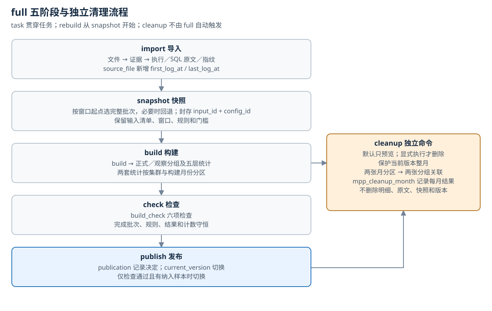
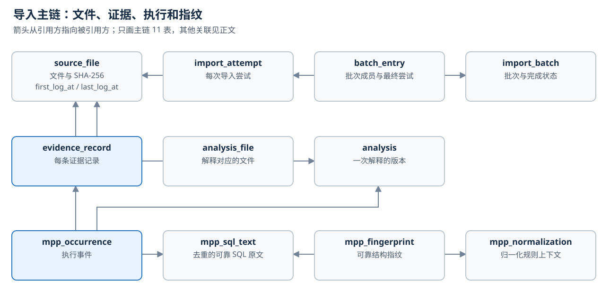
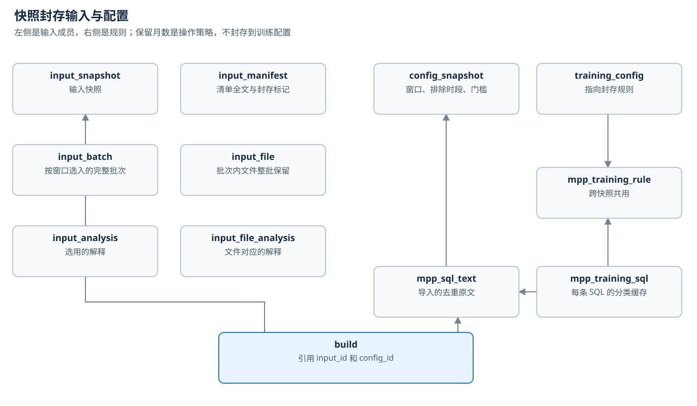
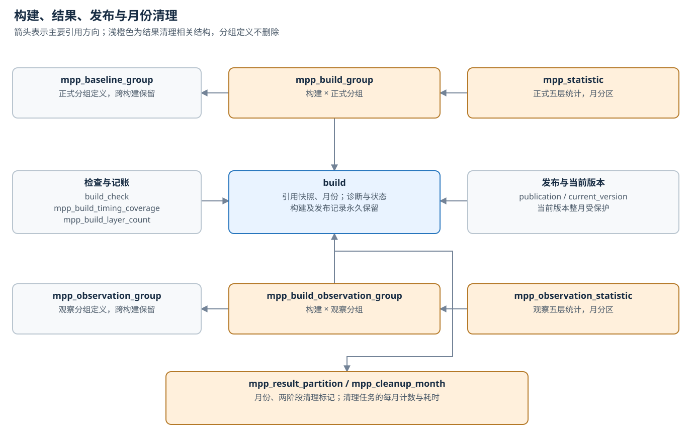

# SQL APM 数据库结构说明（按流程）

对应 v0.2.0；结构 1.9.0。原稿来源为用户提供的 1.6.0 结构说明，现按结构定义及产品代码更新。

表清单对应结构 1.12.0，共 62 张表，其中 32 张带 `mpp_` 前缀；1.12.0 为每日运行新增的五张见“[每日运行：运行记录](#每日运行运行记录)”。图示、函数和版本沿革三部分仍停在 1.9.0。本文按一次 `full` 任务的五个阶段（import → snapshot → build → check → publish）说明每张表存什么、和谁关联、哪些字段最常用。依据是 `sql_apm/storage/schema.sql`。

## 总览

`task` 贯穿全程，记录模式、状态和各阶段耗时。`rebuild` 跳过 import，从 snapshot 开始；发布结果为 `published` 时才切换 `current_version`。

## 通用约定

读表之前先知道三件事。

- **主键是带前缀的文本**，没有自增序列。前缀后面要么是随机串（代表一次运行或一个事件），要么是 SHA-256（同样的输入必须得到同一行）。
- **`mpp_` 前缀**表示这张表的结构只对 MPP 这类 SQL 系统成立。不带前缀的表（文件、批次、快照、构建、发布、任务）是通用框架。
- **几乎每张表都带 `scope_id`**（集群名）。外键多写成 `(某 id, scope_id)` 的组合，保证关联两端属于同一个集群。

| 前缀 | 表 | 生成方式 |
| --- | --- | --- |
| `T:` | `task` | 随机 |
| `AT:` | `import_attempt` | 随机 |
| `I:` | `source_file` | 来源名 + 文件 sha256 |
| `A:` | `analysis` | 批次名 |
| `S:` | `mpp_sql_text` | 随机 |
| `F:` | `mpp_fingerprint` | sql\_id + 归一化版本 |
| `N:` | `mpp_normalization` | 归一化规则上下文 |
| `AI:` | `mpp_approximate_input` | 随机 |
| `AR:` | `mpp_approximate_result` | 输入 + 规则 + 结构原因 |
| `IS:` | `input_snapshot` | 随机 |
| `CS:` | `config_snapshot` | 随机 |
| `TR:` | `mpp_training_rule` | 规则内容 |
| `B:` | `build` | 时间戳 + 随机 |
| `G:` | `mpp_baseline_group` | 分组键 |
| `OG:` | `mpp_observation_group` | 观察分组键 |
| `PUB:` | `publication` | 随机 |
| `P:` | `problem` | 记录级按内容，其余随机 |

不带前缀的主键有四类：`scope_id`、`source_id`、`batch_id` 取自导入配置文件的键名；`record_id` 是 `<file_id>:<记录序号>`；`occurrence_id` 等于其锚点记录的 `record_id`；`partition_id` 是 bigint。

## 基础与任务

这 6 张表不属于某一个阶段：`scope` 被几乎所有表引用，`task` 记录每次命令的运行情况并把各阶段的产物串起来。

| 表 | 一行代表 | 重点字段 | 关联 |
| --- | --- | --- | --- |
| `schema_version` | 一个已应用的结构版本 | `version`、`script_sha256`、`applied_at` | 无。连接时用来校验库的版本 |
| `scope` | 一个集群 | `scope_id`（集群名）、`system_kind`、`profile`、`contract_version` | 被各表以 `scope_id` 或 `(scope_id, profile)` 引用 |
| `task` | 一次命令运行 | `mode`、`state`、`stage`、`stage_seconds`、`reason`、`busy_task_id`、`started_at`、`finished_at` | → `scope`；`busy_task_id` → `task` 自身 |
| `task_batch` | 任务导入了某个批次 | `task_id`、`batch_id` | → `task`、`import_batch` |
| `task_build` | 任务创建了某个构建 | `task_id`、`build_id` | → `task`、`build` |
| `task_publication` | 任务产生了某条发布记录 | `task_id`、`publication_id` | → `task`、`publication` |

`task` 的三个枚举字段：

| 字段 | 取值 |
| --- | --- |
| `mode` | `full`、`import_only`、`rebuild`、`snapshot`、`statistics`、`cleanup` |
| `state` | `running`、`succeeded`、`failed`、`interrupted`、`busy_rejected` |
| `stage` | `import`、`snapshot`、`build`、`check`、`publish`、`cleanup`、`none` |

`stage_seconds` 是 JSON，记录各阶段的墙钟秒数。`task_batch` 记的是任务导入的批次，不是构建用到的批次；后者要从 `task_build` 经 `build.input_id` 到 `input_batch` 查。

## Import：把日志变成证据和事件

导入阶段写 23 张表。主链是：文件 → 证据记录 → 执行事件 → SQL 原文与指纹。一个文件是一个事务，失败时整体回滚。

图中只画主链的 11 张表。`source`、`batch_date`、两张证据关联表、近似观察 5 张和问题记录 3 张见下面各小节。

### 批次与文件（6 张）

| 表 | 一行代表 | 重点字段 | 关联 |
| --- | --- | --- | --- |
| `source` | 一个日志来源的人工声明 | `mapping_ref`（来源配置的内容指纹）、`declared_build`、`timezone`、`declaration_evidence` | → `scope` |
| `source_file` | 一个文件，按来源 + 内容去重 | `checksum_value`、`byte_count`、`first_log_at`、`last_log_at`、`locator`（路径）、`declaration_evidence`（JSON：计数、首尾记录摘要） | → `source` |
| `import_batch` | 一个批次 | `state`、`files_confirmed_complete` | → `scope` |
| `batch_date` | 批次声明的一个日期 | `declared_date` | → `import_batch` |
| `import_attempt` | 对一个文件的一次导入尝试 | `state`、`retry_of`、`duplicate_of`、`reliable_record_count`、`started_at`、`finished_at` | → `import_batch`、`source_file`、自身 |
| `batch_entry` | 批次的一个成员文件 | `final_attempt_id`（最终算数的那次尝试） | → `import_batch`、`source_file`、`import_attempt` |

| 字段 | 取值 |
| --- | --- |
| `import_batch.state` | `pending`、`processing`、`complete`、`failed`、`conflict` |
| `import_attempt.state` | `pending`、`running`、`succeeded`、`duplicate_skipped`、`failed`、`interrupted`、`conflict` |

`import_attempt` 是只增不删的流水，一个文件重试几次就有几行。`batch_entry` 是当前状态，每个（批次，文件）一行；批次里所有成员的最终尝试都成功或重复跳过，批次才是 `complete`。

### 证据与解释（3 张）

| 表 | 一行代表 | 重点字段 | 关联 |
| --- | --- | --- | --- |
| `evidence_record` | 一条日志记录 | `record_no`、`line_start`、`line_end`、`decode_state`、`observed`（JSON，键为 CSV 列序号，只存部分列） | → `source_file` |
| `analysis` | 一次解释，目前一个批次一行 | `mapping_version`、`parser_version`、`association_version`、`evidence_manifest`、`supersedes` | → `scope`、自身 |
| `analysis_file` | 这次解释处理了某个文件 | `analysis_id`、`file_id` | → `analysis`、`source_file` |

`analysis` 和 `import_batch` 之间没有外键。两者的对应只在 ID 算法里：`analysis_id` 是 `A:` 加批次名的哈希。

### 执行事件（2 张）

| 表 | 一行代表 | 重点字段 | 关联 |
| --- | --- | --- | --- |
| `mpp_occurrence` | 一次执行事件 | `database`、`execution_user`、`sql_id`、`sql_state`、`timing_type`、`outcome`、`association_state`、`end_at`、`duration_ms`、`estimated_start_at`、`value_reasons` | → `analysis`、`source`、`evidence_record`（经 `anchor_ref`）、`mpp_sql_text` |
| `mpp_occurrence_evidence` | 事件的一条支撑记录 | `record_id`、`purpose` | → `mpp_occurrence`、`evidence_record` |

`mpp_occurrence` 的主键是 `(analysis_id, occurrence_id)`。

| 字段 | 取值 |
| --- | --- |
| `unit` | `request`、`call` |
| `timing_type` | `request`、`execute_first`、`execute_fetch`、`parse`、`bind`；报错事件为空 |
| `outcome` | `success`、`failed`、`cancelled`、`timed_out`、`unknown` |
| `sql_state` | `complete`、`missing`、`incomplete`、`invalid_encoding`、`uncertain` |
| `association_state` | `reliable`、`unpaired`、`ambiguous` |

事件表只存事实，不存「是否纳入训练」的判定；判定在构建时现算。`estimated_start_at` 等于 `end_at` 减 `duration_ms`。

### SQL 原文与指纹（4 张）

| 表 | 一行代表 | 重点字段 | 关联 |
| --- | --- | --- | --- |
| `mpp_sql_text` | 一条去重后的 SQL 原文 | `text`（原样保存，不做格式化）、`content_sha256` | 被事件、指纹、分类缓存引用 |
| `mpp_sql_text_evidence` | 原文出现在某条日志记录里 | `sql_id`、`record_id` | → `mpp_sql_text`、`evidence_record` |
| `mpp_normalization` | 一个归一化版本 | `algorithm_version`、`parser_version`、`dictionary_rules_version`、`dictionary_digest_value` | 被指纹、配置快照、规则引用 |
| `mpp_fingerprint` | 一条原文在一个归一化版本下的指纹 | `state`、`value`（`struct:…` 结构哈希）、`reason` | → `mpp_sql_text`、`mpp_normalization` |

只有得到可靠指纹的 SQL 才进 `mpp_sql_text`。多条原文可以共用同一个 `value`，分组按 `value` 划分，不按 `fingerprint_id`。

### 近似观察（5 张）

| 表 | 一行代表 | 重点字段 | 关联 |
| --- | --- | --- | --- |
| `mpp_approximate_rule` | 一版近似规则 | `algorithm_version`、`rules_digest`、`rules` | 被近似结果引用 |
| `mpp_approximate_input` | 一份被解析器拒绝的 SQL 原始字节 | `raw_bytes`（bytea）、`byte_length`、`source_sha256` | 被近似结果引用 |
| `mpp_approximate_result` | 一份输入在一版规则下的近似指纹 | `state`、`value`（`approx:…`）、`structural_reason`、`reason` | → `mpp_approximate_input`、`mpp_approximate_rule` |
| `mpp_approximate_evidence` | 近似结果出现在某条日志记录里 | `result_id`、`record_id` | → `mpp_approximate_result`、`evidence_record` |
| `mpp_occurrence_approximate` | 事件对应的近似结果 | `result_id`、`rule_id` | → `mpp_occurrence`、`mpp_approximate_result`、`mpp_approximate_evidence`、`evidence_record` |

这条线与正式指纹隔离：两套表之间没有外键，结果只用于观察统计，不进正式基线。

### 问题记录（3 张）

| 表 | 一行代表 | 重点字段 | 关联 |
| --- | --- | --- | --- |
| `problem` | 一个问题 | `level`、`code`、`effect`、`resolution`、`count` | → `import_batch`、`source_file`、`build`、`mpp_occurrence`，按级别填写 |
| `problem_evidence` | 问题涉及的一条日志记录 | `problem_id`、`record_id` | → `problem`、`evidence_record` |
| `attempt_problem` | 某次导入尝试遇到的问题 | `attempt_id`、`problem_id` | → `import_attempt`、`problem` |

| 字段 | 取值 |
| --- | --- |
| `level` | `record`、`file`、`batch`、`build` |
| `effect` | `isolate_record`、`fail_file`、`hold_batch`、`block_publication`、`informational` |
| `resolution` | `open`、`isolated`、`resolved` |

`problem` 是跨阶段的表：构建失败或中断时，也会写入 `level = build` 的记录。

## Snapshot：封存输入和规则

快照阶段写 10 张表，产出一对标识：输入快照 `input_id` 和配置快照 `config_id`。封存后这些行不可改、不可删。

左边回答「用哪些数据」，右边回答「按什么规则」。`mpp_training_rule` 和 `mpp_training_sql` 画在配置快照之外，因为它们跨快照共用。

### 输入快照（6 张）

| 表 | 一行代表 | 重点字段 | 关联 |
| --- | --- | --- | --- |
| `input_snapshot` | 一次输入快照 | `selection_kind`（目前恒为 immutable_manifest）、`manifest_ref`（清单摘要）、`frozen_at` | → `scope` |
| `input_batch` | 快照选入的一个批次 | `input_id`、`batch_id` | → `input_snapshot`、`import_batch` |
| `input_file` | 快照选入的一个文件 | `input_id`、`file_id` | → `input_snapshot`、`source_file` |
| `input_analysis` | 快照选用的一次解释 | `input_id`、`analysis_id` | → `input_snapshot`、`analysis` |
| `input_file_analysis` | 每个文件用哪一次解释 | `file_id`、`analysis_id` | → `input_file`、`input_analysis`、`analysis_file` |
| `input_manifest` | 清单全文，写入即封存 | `manifest`（JSON：批次、日期、文件、解释、来源声明） | → `input_snapshot` |

快照不逐条登记事件。事件集合由「清单内的文件 + 指定的解释」推导：`input_file_analysis` → `evidence_record`（按 `file_id`）→ `mpp_occurrence`（按 `analysis_id` 和 `anchor_ref`）。

这几张表按「快照 × 批次」或「快照 × 文件」记行。full／rebuild 根据窗口起点筛选已完成批次：任一最终成功或重复跳过文件的 last_log_at 为空或不早于起点，整批入选；不按窗口终点预先剔除。若已完成批次非空而全部被筛掉，则回退全部。事件仍按推算开始时间和完整窗口筛选。

source_file 的 first_log_at／last_log_at 是文件中可解析日志时间的最小／最大值，与配置声明日期分开。旧库升级时不回填，可为空；失败或重复跳过不覆盖已成功文件的时间。snapshot_finished 输出 completed_batches、selected_batches、excluded_batches、window_fallback，用于解释选批。显式 training snapshot 仍按调用者批次清单封存。

### 配置快照与规则（4 张）

| 表 | 一行代表 | 重点字段 | 关联 |
| --- | --- | --- | --- |
| `config_snapshot` | 一次构建的参数 | `cutoff_date`、`window_days`、`window_start`、`window_end`、`blacklist`、`exclusions`、`thresholds`、`statistics_version`、`source_mapping_refs` | → `scope`、`mpp_normalization` |
| `training_config` | 配置的补充，写入即封存 | `rule_id`、`decision_version`、`source_mappings` | → `config_snapshot`（同主键）、`mpp_training_rule` |
| `mpp_training_rule` | 一套规则，内容相同则共用 | `category_rules`、`template_rules`、`normalization_snapshot` | → `mpp_normalization` |
| `mpp_training_sql` | 一条 SQL 在一套规则下的分类结果 | `fingerprint_id`、`category_kind`、`categories`、`template_ids` | → `mpp_sql_text`、`mpp_training_rule`、`mpp_fingerprint` |

`category_kind` 取值 `pure`、`mixed`、`none`、`unknown`；`pure` 表示整条 SQL 都是黑名单类别的语句。

粒度上分两层：`config_snapshot` 和 `training_config` 每次快照各一行；`mpp_training_rule` 在规则不变时始终是同一行，`mpp_training_sql` 的主键是 `(sql_id, rule_id)`，跨快照、跨集群共用。此阶段还会给 `mpp_fingerprint` 补写当前归一化版本下缺失的指纹。

## Build：算出一版统计结果

构建阶段写 10 张表。`build` 是中心：正式结果、观察结果和附属记录都指向它。从判定推导到收尾在同一个事务里，要么全有，要么全无。

上排是正式结果，下排是观察结果，结构对称。统计行经「构建 × 分组」这张清单挂到构建上，分组定义本身跨构建共用。

### 构建与分区（2 张）

| 表 | 一行代表 | 重点字段 | 关联 |
| --- | --- | --- | --- |
| `build` | 一次构建 | `input_id`、`config_id`、`state`、`results_saved`、`partition_id`、`retry_of`、`started_at`、`finished_at`、`diagnostics`（JSON：各状态和原因的计数、分组数） | → `input_snapshot`、`config_snapshot`、`mpp_result_partition`、自身（`retry_of`） |
| `mpp_result_partition` | 一个「集群 + 月份」分区 | `partition_id`、`scope_id`、`build_month`、`cleaned_at`、`groups_cleaned_at` | → `scope` |

`build.state` 取值 `running`、`calculated`、`failed`、`interrupted`。分区在构建创建时确定，一次构建的全部结果在同一个分区。

### 正式结果（4 张）

| 表 | 一行代表 | 重点字段 | 关联 |
| --- | --- | --- | --- |
| `mpp_baseline_group` | 一个分组，跨构建共用 | `database`、`execution_user`、`fingerprint_value`、`timing_type`、`fingerprint_id`（一条代表原文） | → `scope`、`mpp_fingerprint` |
| `mpp_build_group` | 某次构建包含某个分组 | `build_id`、`group_id`、`partition_id` | → `build`、`mpp_baseline_group` |
| `mpp_statistic` | 一个分组在一个时间桶的统计 | `layer`、`bucket_date`、`bucket_number`、`range_start`、`range_end`、`partial_week`、`included_count`、`excluded_count`、`exclusions_by_reason`、17 个指标列、`metric_null_reasons` | → `mpp_build_group` |
| `mpp_build_timing_coverage` | 一次构建中一种计时类型的样本总数 | `timing_type`、`included_count`、`excluded_count` | → `build` |

分组键是集群、库、用户、指纹值、计时类型，`group_id` 由这些值算出，所以同一个分组在各次构建里是同一行。`mpp_statistic` 按 `partition_id` 分区；没有事件的桶不存行。

| `layer` | 桶的标识 | `range_start` 至 `range_end` |
| --- | --- | --- |
| `overall` | 无 | 整个窗口 |
| `day` | `bucket_date` = 日期 | 那一天 |
| `week` | `bucket_date` = 该周周一 | 该周与窗口重叠的部分，`partial_week` 标明是否被截断 |
| `weekday` | `bucket_number` = 1 至 7，周一为 1 | 整个窗口 |
| `hour` | `bucket_number` = 0 至 23 | 整个窗口 |

17 个指标列：`min_ms`、`max_ms`、`mean_ms`、`p25_ms`、`p50_ms`、`p75_ms`、`p90_ms`、`p95_ms`、`p99_ms`、`stddev_ms`、`cv`、`mad_ms`、`iqr_ms`、`log_median`、`log_mad`、`p95_p50`、`p99_p50`。只有被纳入的事件参与指标计算。

### 观察结果（3 张）

| 表 | 一行代表 | 重点字段 | 关联 |
| --- | --- | --- | --- |
| `mpp_observation_group` | 一个观察分组，按近似指纹划分 | `database`、`execution_user`、`approximate_value`、`rule_id`、`timing_type`（可为 unknown） | → `scope`、`mpp_approximate_result` |
| `mpp_build_observation_group` | 某次构建包含某个观察分组 | `build_id`、`group_id`、`partition_id` | → `build`、`mpp_observation_group` |
| `mpp_observation_statistic` | 观察分组在一个时间桶的统计 | `layer`、`bucket_date`、`bucket_number`、`included_count`、`excluded_count`、`metric_null_reasons`；指标列与正式统计相同 | → `mpp_build_observation_group` |

观察结果和正式结果结构对称，但不参加发布检查，也不进正式基线。

### 记账（1 张）

| 表 | 一行代表 | 重点字段 | 关联 |
| --- | --- | --- | --- |
| `mpp_build_layer_count` | 一次构建某一层应有的行数 | `kind`（formal 或 observation）、`layer`、`row_count`、`group_count` | → `build` |

检查阶段用它核对统计结果有没有丢行。构建创建时还会在 `build_check` 预置六行「未运行」，并写一行 `task_build`。

## Check 与 Publish：核对并切换生效版本

这两个阶段只写 3 张表。六项检查全部通过且有有效样本时，当前版本指针才切到新构建。

| 表 | 一行代表 | 重点字段 | 关联 |
| --- | --- | --- | --- |
| `build_check` | 一次构建的一项检查 | `name`、`state`（passed、failed、not_run）、`reason` | → `build` |
| `publication` | 一次发布决定，只增不改 | `build_id`、`previous_build_id`、`result`、`reason`、`at` | → `build`（本次构建和上一个生效构建） |
| `current_version` | 一个集群当前生效的版本 | `build_id`、`publication_id`、`last_success_at` | → `scope`、`build`、`publication` |

`build_check.name` 的六个取值：`batch_complete`、`rules_consistent`、`results_complete`、`results_saved`、`counts_consistent`、`values_consistent`。

| `publication.result` | 条件 | 当前版本 |
| --- | --- | --- |
| `published` | 检查全过，且有有效样本 | 切换到新构建 |
| `no_samples` | 检查全过，但没有纳入的样本 | 不变 |
| `check_failed` | 构建状态不对，或有检查未通过 | 不变 |
| `publish_failed` | 写入时出错 | 不变 |

`current_version` 每个集群一行，外键要求它指向的发布记录必须是 `published`。每次走到发布阶段都会写一行 `publication` 和一行 `task_publication`，包括没有切换版本的情况。

## Cleanup：按构建月份清理结果

cleanup 是独立任务，不是 full 的第六阶段。默认预览只读；显式执行时共用集群任务占用，
增加一张按任务和月份记录的表。

| 表 | 一行代表 | 重点字段 | 关联 |
| --- | --- | --- | --- |
| `mpp_cleanup_month` | 一次清理任务处理一个月份 | `task_id`、`partition_id`、`state`、`reason`、`published_builds`、`unpublished_builds`、`before_bytes`、`after_bytes`、`released_bytes`、`formal_groups_deleted`、`observation_groups_deleted`、`started_at`、`finished_at`、`exclusive_seconds`、`group_seconds` | → `task`、`mpp_result_partition` |

状态为 pending、removing_groups、succeeded、retained、protected、already_cleaned、
lock_timeout、failed、interrupted。每月独立收尾，不因一个月失败撤销先前月份。

按数据库时钟的北京时间保留当月和前 N 个整月，默认 N=2，最小 1；按构建月而非日志日期
判断。当前版本所在整月受保护。过期月份先在短事务内删除正式／观察两个月分区并写
cleaned_at，再按小批删除两张构建分组关联，最后写 groups_cleaned_at。
这两个时间分别表示统计分区已清理、分组关联已清完；中断可从已有标记继续。
每月共享 10 秒锁等待预算，实际删除时间不计入等待；exclusive_seconds 记录持有排他锁的耗时。

构建、发布、前驱指针、六项检查、各层计数、分组定义、原文和明细、输入／配置快照均保留。
history 根据月份标记显示结果已清理；results_saved 保留“曾完整保存”的事实。
清理后不能把查不到结果解释为零样本，使用下面的受支持函数取得 results_cleaned 错误。

## 每日运行：运行记录

每日运行不是 full 的阶段。它按集群逐个调用导入、重建和清理这些既有步骤，自己只多写五张表，
记录每次运行看到了什么、做了什么。这五张表只描述，不拥有别的表里的行：任务、构建、发布和文件的标识
以文本保存，没有外键。

| 表 | 一行代表 | 重点字段 | 关联 |
| --- | --- | --- | --- |
| `mpp_daily_run` | 每日运行命令的一次执行 | `run_id`、`started_by`、`state`、`failed`、`reason`、`started_at`、`finished_at`、`local_date`、`stale_after_hours` | 被下面的表引用 |
| `mpp_daily_cluster` | 一次运行里的一个集群 | `run_id`、`scope_id`、`ordinal`、`state`、`failed`、`import_state`、`examined_days`、`newest_imported`、`build_state`、`cutoff_date`、`build_id`、`publication_id`、`cleanup_state`、`months_cleaned`、`months_pending`、`released_bytes`、`raw_state`、`raw_days`、`raw_files`、`raw_bytes`、`stage_seconds` | → `mpp_daily_run` |
| `mpp_daily_day` | 一次运行里某个来源某一天的导入结果 | `source_id`、`log_date`、`state`、`reason`、`batch_id`、`file_count`、`byte_count`、`added_records`、`seconds`、`files` | → `mpp_daily_cluster` |
| `mpp_daily_problem` | 一次运行处理完一个集群后留给人的一件事，或接收目录里一个不合命名的文件 | `kind`、`source_id`、`log_date`、`result_month`、`reason`、`file_name`、`file_count` | → `mpp_daily_cluster` |
| `mpp_daily_file` | 已导入日期的一个文件名（不随运行重复） | `source_id`、`log_date`、`file_name`、`scope_id`、`batch_id`、`file_id`、`byte_count`、`device`、`inode`、`mtime_ns`、`ctime_ns`、`verified_at`、`verified_run_id`、`removing_at`、`removing_run_id`、`removed_at`、`removed_run_id`、`cleared_at`、`cleared_run_id` | `file_id` 对应 `source_file`，运行标识对应 `mpp_daily_run`，均无外键 |

`mpp_daily_run.state` 为 running、finished、aborted、unfinished。同一时间只有一个每日运行；
一个仍标为 running 却没有进程持有运行锁的记录就是被强制终止的，查询函数直接把它显示为 unfinished，
下一次运行再把它改写为 unfinished。`mpp_daily_cluster.state` 为 pending、running、done、skipped、aborted；
它的四个步骤各有自己的状态列，每一步有了结果就写入；`examined_days` 记本次运行已经看过并有结论的日期。
删除的文件数和字节数随每个文件的删除、天数随每一天删除完成，各在同一个事务里累加。
`mpp_daily_problem.kind` 的六个取值是需要人处理的事，发现时即写入；`nonconforming_file` 只是对接收目录的记录。
另有三类待处理问题不入表，由查询函数现算：最近一次轮到某个集群时它被跳过、最近一次运行没有正常结束、
太久没有成功的运行。`mpp_daily_file` 记的是文件的内容对应关系和最近一次核对时的文件状态（核对不符时为空），
以及删除的决定、每个文件的删除和整天删除完成三步的进度；它使“删除被打断”和“文件被人改动”能够分清。字段含义和查询函数见[每日运行开发说明](daily-run.md)。

## 预留未写入的表

这 4 张表来自早期设计，当前流程没有写入它们的代码。

| 表 | 一行代表 | 重点字段 | 关联 |
| --- | --- | --- | --- |
| `mpp_decision` | 预留事件判定，当前用函数现算 | `build_id`、`analysis_id`、`occurrence_id`、`state` | → `build`、`mpp_occurrence` |
| `mpp_decision_reason` | 预留判定原因 | `decision_id`、`code`、`rule_ref` | → `mpp_decision` |
| `mpp_decision_reason_evidence` | 预留原因证据 | `decision_id`、`code`、`record_id` | → `mpp_decision_reason`、`evidence_record` |
| `mpp_input_occurrence` | 预留逐条输入，当前由文件清单推导 | `input_id`、`analysis_id`、`occurrence_id` | → `input_snapshot`、`mpp_occurrence` |

## 常用关联路径

下表是跨阶段查询时最常走的连表路径。

| 想查什么 | 怎么连 |
| --- | --- |
| 某集群当前生效版本的统计 | `current_version` → `build` → `mpp_read_statistics(build_id)`；历史版本同样用受清理保护的读取函数 |
| 某个分组是什么 SQL | `mpp_baseline_group.fingerprint_id` → `mpp_fingerprint.sql_id` → `mpp_sql_text.text`，得到一条原文样例 |
| 某个分组的全部原文 | `mpp_baseline_group.fingerprint_value` = `mpp_fingerprint.value`（同一 `normalization_id`）→ `mpp_sql_text` |
| 某个分组的执行历史 | 上一行得到的 `sql_id` → `mpp_occurrence`，再按 `scope_id`、`database`、`execution_user`、`timing_type` 筛选 |
| 一条事件的原始日志 | `mpp_occurrence.anchor_ref` → `evidence_record` → `source_file.locator` 加 `line_start` |
| 一条事件的 SQL（可靠） | `mpp_occurrence.sql_id` → `mpp_sql_text` |
| 一条事件的 SQL（近似） | `mpp_occurrence_approximate` → `mpp_approximate_result` → `mpp_approximate_input.raw_bytes` |
| 一条事件在某次构建里的判定 | 函数 `mpp_training_decisions(input_id, config_id, analysis_id, occurrence_id)` |
| 一次任务产生了什么 | `task` → `task_batch`、`task_build`、`task_publication` |
| 一次构建用了哪些文件 | `build.input_id` → `input_file` → `source_file` |
| 一次构建的窗口和规则 | `build.config_id` → `config_snapshot`；再经 `training_config.rule_id` → `mpp_training_rule` |
| 一个批次的导入结果 | `import_batch` → `batch_entry.final_attempt_id` → `import_attempt` |
| 一个文件的问题 | `problem`（按 `file_id`）→ `problem_evidence` → `evidence_record` |

这些路径上已有的索引：`mpp_occurrence` 的 `(sql_id, estimated_start_at)` 和 `(scope_id, estimated_start_at)`，`mpp_fingerprint` 的 `(normalization_id, profile, value)`，`mpp_statistic` 的 `(group_id, build_id, layer)`。事件表里没有指纹和分组列，按分组查事件必须先经指纹表找到 `sql_id`。

## 函数与触发器

部分结论不存在表里，而是由函数现算；部分约束由触发器保证。

| 名称 | 类型 | 作用 |
| --- | --- | --- |
| `mpp_training_decisions` | 函数 | 给定输入快照和配置快照，逐条事件返回判定（`included`、`excluded`、`unresolved`、`outside_window`）、原因码和所属分组 |
| `mpp_statistic_sufficiency` | 函数 | 按封存的门槛判断一行统计的样本是否充足，查询时调用 |
| `mpp_coverage` | 函数，1.9.0 替换 | 推导每组各层已计算桶和空桶；先检查清理标记 |
| `mpp_ensure_result_partition` | 函数，1.9.0 替换 | 建立集群／月份分区；拒绝重新创建已清理月份 |
| `mpp_require_results` | 函数，1.9.0 新增 | 在读取锁下核对 results_saved 与 cleaned_at；已清理时抛出 results_cleaned |
| `mpp_read_statistics` | 函数，1.9.0 新增 | 经清理保护读取正式或观察统计，支持指定分组 |
| `mpp_check_build_groups`、`mpp_check_build_observation_groups` | 触发器函数，1.9.0 替换 | 校验两套构建分组的上下文，并拒绝向已清理月份新增或改写关联 |
| `mpp_result_context_guard` | 触发器函数，1.9.0 替换 | 保持上下文和月份约束；拒绝把构建放入已清理月份 |
| `training_immutable` | 触发器 | 快照、配置、规则、分类缓存封存后拒绝增删改 |
| `mpp_build_group_context`、`mpp_observation_group_context` | 触发器 | 构建与其分组的集群、归一化版本、profile 必须一致 |
| `mpp_result_context`、`mpp_observation_context` | 触发器 | 已有结果的构建和分组不能改上下文；构建的分区月份必须与开始时间一致 |

## 1.6.0 到 1.9.0 的版本沿革

| 结构版本 | 变化及兼容性 |
| --- | --- |
| 1.6.0 | 56 张表；覆盖由函数推导；对应 v0.1.0 |
| 1.7.0（#33） | system_kind 从 hashdata 改为 mpp；hashdata-csv/1 → mpp-csv/1、hashdata-csv-reader/1 → mpp-csv-reader/1、hashdata-3.13.13/1 → mpp-mapping/1、hashdata-pg94 → mpp-sql；上下文 ID 变化，旧库必须重建 |
| 1.8.0（#35） | source_file 增加 first_log_at、last_log_at；按窗口起点选批；可从 1.7.0 带数据升级，不回填时间 |
| 1.9.0（#43） | 57 张表；新增清理月份记录、cleaned_at／groups_cleaned_at、task 的 cleanup 模式／阶段，替换五个函数、新增两个函数；可从 1.8.0 带数据升级 |

1.10.0 至 1.12.0 的变化见[物理设计](postgresql-storage.md)。

依据为结构定义、迁移和各阶段代码。表数不含动态月分区子表。表清单和所列字段由
开发机的 `scripts/deployment/check_documents.py` 对照结构定义检查；该命令仅在开发仓库运行。
预留表“未写入”按当前写入路径判断。v0.1.0 数据库必须重建；0.x 预发布间不承诺兼容。
1.7.0／1.8.0 带真实数据升级的证据来自开发机，目标机仅执行合成升级检查。
